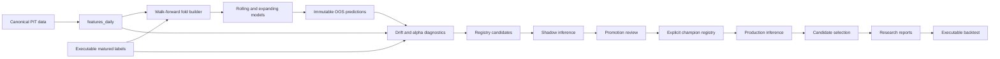

# Phase 2.6.2 Model Adaptation and Stable Alpha Design

## Scope and principles

Phase 2.6.2 adds model-drift diagnostics, chronological model comparison, rolling retraining, and
multi-horizon research without replacing the current architecture:

```text
data -> feature -> model -> inference -> candidate -> research -> backtest
```

The implementation remains single-host and file-first. It continues to use Python, Parquet,
DuckDB/Polars, LightGBM, pytest, Ruff, and mypy. It must not introduce a model service, feature
store, scheduler, database, or a second orchestration framework. Production inference continues to
read only the explicitly promoted champion. Challenger creation and evaluation never alter daily
rankings until promotion is approved.

The objective is stable cross-sectional alpha, not the highest historical return.

## 1. Current model failure analysis

The frozen Ranker was trained on 2010-2019, validated on 2020-2022, and evaluated OOS from 2023 to
2026-07-09. Phase 2.6.1 measured:

| Period | Mean Rank IC | ICIR | Positive IC days | Top 10% 5d excess | Bottom 20% 5d excess |
| --- | ---: | ---: | ---: | ---: | ---: |
| 2025 | 0.0768 | 1.017 | 88.5% | 0.746% | -0.116% |
| 2026 partial | 0.0424 | 0.508 | 74.0% | -0.215% | -0.667% |

This is not complete alpha disappearance. Broad ordering remains positive because Top 10% still
beats Bottom 20% in 2026, but three failures are visible:

1. **Ranking alpha weakened:** Rank IC and ICIR fell materially from 2025.
2. **Score-tail concentration failed:** Top 1% and Top 5% do not consistently outperform Top 20%.
3. **Portfolio translation failed:** concentrated executable Top-N portfolios lost excess return
   despite weak positive broad ranking information.

Likely causes must be tested rather than assumed:

* feature-distribution drift in liquidity, amount variability, residual volatility, and momentum;
* changing feature/return relationships, including sign changes by market state;
* universe composition and breadth changes since the 2010-2019 training period;
* stale tree thresholds from an old training distribution;
* a five-day target that no longer matches the persistence of current signals;
* Top-N concentration, turnover, and tradability effects that are not visible in broad Rank IC.

The 2026 period is partial and has already influenced this design review. It is therefore a
**diagnostic replay period**, not an untouched final test for Phase 2.6.2. Final promotion requires
future shadow observations generated after this design is frozen.

## 2. Diagnostics enhancement design

Diagnostics remain post-hoc. They read immutable predictions, same-date features, and matured
realized labels. They never write features, retrain models, alter scores, or participate in daily
candidate selection.

### Feature drift

For each frozen model feature, compare a reference distribution with each evaluation month:

* missing and non-finite ratios;
* median, interquartile range, and robust tail quantiles;
* Population Stability Index (PSI);
* two-sample Kolmogorov-Smirnov statistic;
* eligible-universe coverage and cross-sectional dispersion.

PSI bins are fitted once from training data and persisted in the model manifest. Missing values use
an explicit bin. Suggested initial reporting bands are PSI below 0.10 as small, 0.10-0.25 as
material, and above 0.25 as severe. These are warnings, not automatic proof of concept drift. For
large A-share samples, KS p-values will be nearly always significant, so decisions use the KS D
statistic and effect persistence rather than p-value alone.

Use two references:

1. the full model training distribution for reproducibility;
2. the most recent training year for recency comparison.

### Score drift

Raw LightGBM scores are comparable only within the same model artifact. Report by month:

* score mean, standard deviation, quantiles, PSI, and KS statistic;
* daily rank-percentile distribution;
* score spread between Top 1%, Top 10%, median, and Bottom 20%;
* rank concentration, effective breadth, and Top-N overlap/turnover;
* score correlation with the previous model when champion and challenger score the same universe.

Across different models, compare percentile ranks and Top-N overlap, not raw score levels.

### Feature-response drift

Once horizon-H labels have matured, report monthly and regime-level:

* daily feature Rank IC and ICIR;
* disjoint feature quintile/decile returns and top-minus-bottom spread;
* response sign versus the training period;
* model SHAP magnitude and sign stability;
* gain/split importance drift;
* proportion of features whose response sign reversed persistently.

Feature-response drift is delayed by the label horizon and can never be a same-day inference gate.
Daily production may warn on feature/score drift immediately; response drift is a later model-health
signal.

### Market-state and Top-N decomposition

Replace coarse post-hoc annual bull/bear labels with a signal-date state based only on trailing
benchmark return and realized volatility. Fit return/volatility thresholds on the fold training
period, freeze them for validation/evaluation, and retain `unknown` when history is insufficient.
Report alpha by bull, bear, neutral, and high-volatility states. Regime labels are diagnostic slices,
not model inputs or dynamic ensemble switches in this phase.

Diagnose Top-N failure as a funnel rather than attributing every loss to the Ranker:

```text
full score cross-section
  -> model Top-N
  -> candidate filters
  -> next-open tradability
  -> executed holdings
  -> gross return
  -> costs and net return
```

Record overlap and return at each step, buy/sell rejection reasons, turnover, concentration, and the
gap between broad bucket alpha and executable Top-N alpha. This distinguishes ranking decay from
candidate-policy, capacity, and execution effects without changing those components.

### Drift outputs

Proposed output:

```text
reports/model_diagnostics/<diagnostic_run_id>/
  feature_drift.parquet
  score_drift.parquet
  feature_response.parquet
  bucket_returns.parquet
  regime_metrics.json
  summary.json
  diagnostics_report.md
  manifest.json
```

Use disjoint deciles for monotonicity. Existing overlapping Top 1/5/10/20 cohorts remain useful for
capacity views but cannot establish strict bucket monotonicity.

## 3. Walk-forward framework design

Walk-forward is the common evaluator for all training policies. Each fold contains:

```text
fit period -> purged validation period -> embargo -> evaluation month
```

For evaluation month M:

1. resolve all boundaries from `trade_cal`;
2. include only labels with `exit_date` on or before the fold's label-availability cutoff;
3. fit preprocessing and the Ranker using fit rows only;
4. use validation only for approved quality gates or early stopping;
5. freeze the fold model and score every eligible date in M;
6. publish immutable OOS predictions before loading evaluation labels;
7. append fold predictions to a walk-forward OOS artifact without rescoring past months.

Both rolling and expanding policies must use identical evaluation months, feature lists, fixed
parameters, execution assumptions, and metric definitions. This makes training-window policy the
only changed variable.

Recommended research timeline:

* development replay: multiple monthly folds through 2025;
* diagnostic replay: 2026, explicitly marked as already observed;
* promotion evidence: future shadow months after implementation freeze.

## 4. Rolling five-year monthly retraining

For each prediction month M, define a five-year development window ending before M. The default
split is:

* fit: earliest four years;
* validation: most recent one year;
* purge/embargo: at least the target horizon, based on actual `entry_date` and `exit_date`;
* evaluation: month M.

Retrain once after the prior month closes and all required labels for fit/validation are mature.
The model is immutable for the whole prediction month. Mid-month retraining is prohibited except
for an explicitly documented operational recovery that produces a new model ID.

Track between consecutive monthly models:

* feature and parameter hashes;
* rank correlation on a common date;
* Top-N overlap and prediction turnover;
* gain/SHAP importance drift;
* validation Rank IC and worst-month result;
* training rows, groups, and effective independent label observations.

Rolling training is the primary challenger because it can adapt tree thresholds and relationships.
Its risks are smaller samples and excessive model churn, so it must beat the expanding baseline on
median and worst-fold stability, not only on recent return.

## 5. Expanding baseline

The expanding baseline starts at 2010-01-01 and grows up to each fold cutoff. It uses the same
trailing validation duration, purge, evaluation months, frozen features, and LightGBM parameters as
the rolling challenger.

For a 2026 replay, an admissible comparison is fit through 2024, validate on eligible 2025 data,
then evaluate 2026 month by month. After research approval, a deployment candidate may train through
2025, but its 2026 replay remains previously observed and cannot be called a final test.

The baseline answers whether recent data helps beyond merely increasing sample size. If rolling and
expanding both fail in the same periods, the likely issue is target/feature regime dependence rather
than training-window staleness.

## 6. Challenger model lifecycle

Reuse the existing immutable model registry and statuses: `candidate`, `champion`, and `retired`.
Do not add automatic promotion.

Lifecycle:

```text
walk-forward research
  -> immutable candidate artifact
  -> registry candidate
  -> champion/challenger shadow predictions
  -> matured-label comparison
  -> explicit promotion review
  -> champion or retired
```

A challenger must record its training policy (`rolling_5y_monthly` or `expanding`), horizon, fold
evidence, and comparison against the champion. Daily inference continues loading the champion only.
Shadow inference writes a separate report tree and cannot feed candidate selection.

Promotion requires all of the following:

* positive median fold Rank IC and acceptable worst fold;
* stable ICIR and positive-IC ratio across years and regimes;
* disjoint bucket ordering and positive top-minus-bottom spread;
* no persistent recent response-sign collapse;
* executable Top-N behavior that is not materially worse after costs and constraints;
* controlled model-to-model rank turnover and adequate breadth;
* a completed future shadow period;
* matching feature/config/source manifests and clean validation.

No single Sharpe, annual return, month, or regime can promote a model.

## 7. Multi-horizon model design

Train separate Rankers for executable excess-return labels at 5, 10, 20, and 60 trading days.
Every label keeps the current after-close signal, T+1 open entry, adjusted-open exit, benchmark, and
tradability semantics.

| Horizon | Intended signal | Expected turnover | Research concern |
| --- | --- | ---: | --- |
| 5d | fast reversal/momentum | high | noise and unstable Top-N tail |
| 10d | short-medium persistence | medium-high | overlapping labels |
| 20d | monthly persistence | medium | fewer independent samples |
| 60d | strategic persistence | low | stale exposures and regime concentration |

The current label store supports 5d and 10d but needs separately validated 20d and 60d construction
before those models exist. Longer horizons require longer purges and later diagnostics maturity.
Feature lists should initially remain identical so the horizon is the controlled variable. Feature
selection per horizon is a later nested research task.

## 8. Ensemble design

Do not average raw LightGBM scores. Convert every horizon model's daily score to a percentile rank
within the same eligible universe.

Evaluate in this order:

1. equal-weight percentile blend as the mandatory baseline;
2. fixed validation-only weights, clipped and normalized, based on multi-fold IC/ICIR stability;
3. separate horizon sleeves with each sleeve retaining its own holding period.

Horizon sleeves are preferred for executable evaluation because a 60d target should not be judged
using a 5d exit. A single consensus rank may still feed the unchanged candidate selector for human
research, while executable backtests maintain sleeve-specific holdings and aggregate portfolio
returns afterward.

Reject an ensemble when component rank correlations are too high, one model dominates weight, the
blend improves only one regime, or turnover removes the gross benefit. Dynamic regime weights are
out of scope until static blending proves stable.

## 9. Data flow



Labels never enter production inference, candidate selection, or score generation.

## 10. Proposed CLI design

These commands are design proposals and do not exist until implemented:

```bash
# Enhanced read-only diagnostics
ashare-quant backtest diagnostics --run-id RUN_ID --include-drift

# Compare rolling and expanding policies through immutable folds
ashare-quant models walk-forward --config-name phase_2_6_2 --start 20150101 --end 20260709

# Build one as-of challenger without promoting it
ashare-quant models train-rolling --as-of 20260731 --window-years 5 --horizon 10
ashare-quant models train-expanding --as-of 20260731 --horizon 10

# Train and compare horizon-specific candidates
ashare-quant models train-horizon --as-of 20260731 --horizon 5
ashare-quant models ensemble-evaluate --walk-forward-run-id RUN_ID

# Inspect and explicitly promote through the existing registry
ashare-quant models list
ashare-quant models champion
ashare-quant models promote MODEL_ID
```

Date and policy details should primarily live in validated YAML; CLI flags select an experiment or
override one narrow value. Every command must be resumable and must refuse to overwrite immutable
fold/model artifacts.

## 11. Manifest design

Create one parent walk-forward manifest and one manifest per fold/model. Required fields:

```text
schema_version
run_id / fold_id / model_id
training_policy
horizon
fit_start / fit_end
validation_start / validation_end
evaluation_start / evaluation_end
label_availability_cutoff
purge_sessions / embargo_sessions
maximum_included_label_exit_date
feature_list / feature_hash
model_parameters / random_seed
git_commit / git_dirty / config_hash
source artifact manifests
training rows / groups / dates
validation and OOS metrics
reference distribution bins and fingerprints
prediction artifact path and hash
ensemble members / weights / weight-selection period
created_at / completed_at / status
```

The parent manifest records ordered folds, failed/skipped folds, aggregate metrics, and the exact
rule used to compare rolling versus expanding. Manifests are written atomically after successful
publication. Failure must not replace a prior valid artifact.

## 12. Future-information prevention

1. Resolve all dates from `trade_cal`, never row offsets from sparse stock observations.
2. Include a label only when its `exit_date` is on or before the fold's availability cutoff.
3. Purge fit/validation boundaries by the actual maximum horizon and add an explicit embargo.
4. Fit missing-value handling, winsorization, normalization, feature selection, model parameters,
   drift bins, and ensemble weights using fit/validation data only.
5. Preserve existing financial statement `availability_date` semantics and PIT universe joins.
6. Freeze each monthly model before its evaluation month begins.
7. Publish OOS predictions before joining realized returns.
8. Use only backward-looking market information to assign a signal-date regime. Post-hoc future
   regime labels may be used for reporting but never for model or ensemble routing.
9. Treat 2026 as observed diagnostic data. Reserve future shadow months for promotion evidence.
10. Add manifest assertions for maximum feature date, maximum label exit date, and fold chronology.

## 13. Test strategy

### Unit tests

* PSI/KS calculations, explicit missing bins, constant features, and insufficient samples;
* score percentile normalization, ties, empty dates, and model-version scale differences;
* feature-response sign changes and disjoint bucket monotonicity;
* rolling/expanding boundary construction from `trade_cal`;
* horizon-specific purge and embargo for 5d/10d/20d/60d;
* deterministic rank blending and weight normalization;
* manifest validation and atomic publication.

### Leakage regression tests

* changing features after an evaluation date cannot change earlier predictions;
* changing future labels cannot change trained fold models or predictions;
* no training label may have `exit_date` after the fold cutoff;
* validation/test rows cannot affect preprocessing, drift bins, features, or ensemble weights;
* shadow predictions cannot enter production candidate selection;
* 60d models enforce the longer purge rather than reusing the 5d boundary.

### Integration tests

* fixture walk-forward run with ordered immutable fold predictions;
* rolling and expanding policies evaluated on identical dates and universes;
* candidate registration, shadow comparison, explicit promotion, and rollback;
* multi-horizon model bundle and ensemble provenance;
* deterministic rerun produces identical predictions and metrics;
* one failed fold records failure and cannot publish a successful parent manifest.

### Acceptance tests

On real local data, report runtime, peak memory, fold coverage, Rank IC/ICIR, yearly/regime metrics,
bucket monotonicity, turnover, model-rank correlation, and drift. Acceptance is based on median and
worst-fold stability plus future shadow evidence. Historical return alone is not an acceptance
criterion.

## Recommended implementation sequence

1. Phase 2.6.2A: drift diagnostics and disjoint score buckets.
2. Phase 2.6.2B: generic purged walk-forward fold engine.
3. Phase 2.6.2C: expanding baseline and rolling-five-year monthly challenger.
4. Phase 2.6.2D: executable 20d/60d labels and horizon-specific models.
5. Phase 2.6.2E: static percentile ensemble and horizon sleeves.
6. Phase 2.6.2F: registry shadow comparison and explicit promotion gate.

The first implementation should stop after each subphase passes unit tests, full tests, Ruff, mypy,
and provenance review. No production champion should change during Phase 2.6.2 development.
