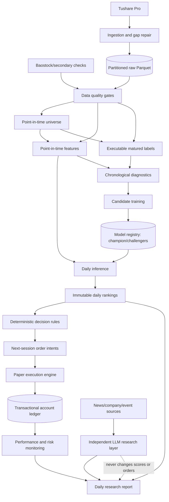

# Production Quant Research and Paper-Trading Architecture

## Scope and Design Principles

This document reviews the current repository and defines the next architecture for an automated
A-share research and paper-trading platform. It is a roadmap, not a description of features that
already exist. New CLI commands below are explicitly marked **proposed**.

The platform remains a single-host, file-first system until operational evidence justifies a
service architecture. Parquet remains the canonical analytical format, DuckDB/Polars handle
batch computation, and systemd coordinates jobs. Every decision must be reproducible from an
as-of timestamp, immutable configuration, source fingerprints, model identity, and account state.
Inference must never read labels, and LLM output must never alter model scores or orders.

## Current-State Assessment

The repository already has strong research foundations:

- Tushare ingestion has process-local pacing, retries, permission diagnostics, idempotent atomic
  partition writes, calendar-derived gap scanning/repair, bounded revision lookbacks, and snapshot
  refresh policies.
- Raw validation checks required schemas, primary keys, selected market-data invariants, and
  trading-day coverage. Failed validation propagates a non-zero CLI exit status.
- Universe, labels, and features are partitioned by month and record lightweight build manifests.
  Historical ST state, suspension-aware rolling windows, T+1-open labels, and revision-safe
  statement joins are explicitly handled.
- Diagnostics enforce chronological train/validation/test boundaries. Ranker experiments are
  immutable, while production training writes an atomic model directory with provenance.
- The backtest scores the model independently of labels, applies next-open execution constraints
  and costs, and records pre-execution rankings in `predictions.csv`.

The main production gaps are orchestration and state management. There is no dedicated inference
command, run ledger, cross-process lock, model registry/promotion workflow, persistent paper
account, monitoring baseline, or daily report generator. `strategy`, `reporting`, and generic
`validation` packages are currently placeholders. Raw Parquet is corrected in place, so existing
fingerprints diagnose likely staleness but cannot reproduce every prior raw-data revision exactly.
The current backtest is also not yet a paper broker: it does not persist an account across runs,
and production trading details such as 100-share lots, minimum commission, corporate actions,
effective-dated fee rules, and order lifecycle need explicit treatment.

## Target Architecture



The orchestrator calls modules through the CLI and treats each non-zero exit code as a failed
gate. A run may publish downstream artifacts only after all required upstream gates pass.

## 1. Data Pipeline

### Existing behavior

`ashare-quant data update` advances from local maximum dates. `--repair-gaps` scans eligible
date-partitioned datasets against `trade_cal` and fetches missing open dates only; `index_daily`
is checked per configured index code. Revision-prone endpoints re-fetch recent open days, and
financial data uses a bounded announcement/revision lookback. Snapshot refresh supports
`manual`, `always`, and `ttl_days`. Writes merge by dataset primary key and atomically replace one
partition or snapshot.

These mechanisms are suitable building blocks, but daily automation needs additional controls:

1. **Session-aware freshness contracts.** Define required availability by dataset and run time.
   For example, `daily`, `adj_factor`, `daily_basic`, `stk_limit`, and the benchmark index should
   reach the expected completed A-share session. Event datasets and financial statements need
   separate, softer publication SLAs rather than a blanket same-day rule.
2. **Hard and soft dataset tiers.** Core inference inputs are hard gates. Optional research data
   may warn without blocking. Permissions and legitimate empty results must be recorded per
   endpoint and date.
3. **One-writer locking.** Use a repository-scoped `flock` around ingestion and processed builds.
   Atomic files prevent partial partitions, but they do not prevent two processes from racing to
   merge the same partition.
4. **Run manifests.** Record run ID, command, start/end time, expected session, request statistics,
   validation outcomes, changed partitions, code/config identity, and upstream fingerprints under
   `runs/YYYYMMDD/<run-id>/`.
5. **Stronger quality gates.** Add per-date row-count bands, benchmark presence, stock coverage
   relative to the PIT listed universe, null-rate drift, OHLC/limit checks, and financial
   availability-date checks. Secondary-source comparisons remain advisory because vendors can
   differ legitimately.
6. **Recoverability.** Keep current canonical Parquet, but archive replaced snapshot metadata and
   partition fingerprints. Exact historical replay ultimately requires immutable raw revisions or
   periodic raw snapshots; current row/date fingerprints alone are not sufficient.
7. **Observability.** Emit a compact health summary with freshness lag, gaps, retries, permission
   skips, validation failures, bytes written, and elapsed time. Alert only after bounded retries.

The safe daily order is: update `trade_cal`; update core datasets with recent-revision lookback;
scan/repair gaps; validate; assert freshness; then publish a successful data-stage marker. Slow
extended datasets should run in separate maintenance jobs so they cannot delay daily scoring.

## 2. Model Lifecycle

### Diagnostics and training

Current diagnostics freeze feature selection before loading the historical holdout. That
test period must not be reused every week. Weekly monitoring should instead evaluate predictions
whose 5-day labels have newly matured. Feature reselection is a governed research event with a
new chronological split, not an automatic consequence of a weak week.

Monthly retraining should create an immutable candidate using:

- the frozen robust feature list;
- all eligible labels whose exit date is known by the training cutoff;
- the same fixed baseline parameters unless a separately approved tuning study changes them;
- exact source manifests, code revision, config hash, feature hash, training cutoff, random seed,
  and package versions.

Replace the mutable-only `models/production/` publication pattern with immutable versions:

```text
models/
  registry/
    ranker_YYYYMMDD_<feature-hash>_<git-short>/
      model.txt
      feature_list.json
      metrics.json
      manifest.json
      approval.json
  aliases/
    champion.json
    challenger.json
```

Alias files are atomically replaced pointers; model directories are never overwritten. Rollback
means repointing `champion.json` to a prior approved artifact.

### Champion/challenger comparison and promotion

Candidates first run in shadow mode and score the same daily universe as the champion. Comparison
must use only data available after each candidate's training cutoff. Promotion is blocked unless:

- manifests, feature schema, and data quality gates pass;
- rolling Rank IC is directionally positive and not materially worse than the champion;
- yearly/monthly stability and universe coverage remain acceptable;
- executable Top-N proxy or paper results do not materially degrade net excess return, Sharpe,
  drawdown, turnover, or capacity;
- score distribution, missingness sensitivity, and feature importance do not show unexplained
  drift;
- a minimum shadow period, recommended 20 completed trading days, has elapsed.

No single metric should promote a model. Thresholds should be configured as absolute floors plus
relative non-inferiority bounds. Promotion remains an explicit operator action initially; only
after a stable audit history should automatic promotion be considered.

Daily monitoring records feature missingness/drift, universe size, score distribution, rank
turnover, prediction overlap, execution rejection rates, and paper-account exposure. Once labels
mature, it adds rolling Rank IC, top-decile excess return, and calibration by score bucket.

## 3. Daily Prediction System

Create a dedicated `ashare_quant.inference` module rather than invoking the backtest for live
ranking. Its as-of contract is: after close on trade date T, read only data available by the run
timestamp, score `in_model_universe=true` rows for T, and create conditional T+1 order candidates.
Signal-date `can_buy` must not be treated as knowledge of T+1 tradability.

Before scoring, inference must verify:

- T is an open, completed session and all hard raw datasets meet freshness SLAs;
- universe and features contain exactly one row per `(trade_date, ts_code)` for T;
- processed manifests match the current configuration and upstream data versions;
- the model feature hash and physical columns match exactly;
- feature missingness and eligible-universe size are inside configured bounds;
- the selected model is the registry champion and has an approved manifest.

Publish atomically to:

```text
reports/daily/YYYYMMDD/
  ranking.csv
  recommendations.csv
  feature_contributions.csv
  risk_warnings.json
  report.md
  manifest.json
```

`ranking.csv` contains all eligible stocks, deterministic rank, score, model ID, and universe
flags. `recommendations.csv` contains configured Top-N candidates and clearly labels execution as
pending T+1 open checks. LightGBM `pred_contrib` values may provide local feature contributions;
they are model explanations, not causal explanations. Risk warnings include stale/missing inputs,
high feature missingness, abnormal liquidity, ST/suspension state known at T, concentration,
score instability, and model/data staleness. Every file carries the same run ID and model ID.

## 4. Paper-Trading Module

The existing backtest should remain immutable research infrastructure. Add a separate
`ashare_quant.paper` boundary with persistent account state and the same execution primitives
where practical.

Use an append-only event ledger with transactional updates. A small SQLite file is appropriate
for orders, fills, cash movements, positions, and corporate-action events; daily Parquet/CSV
exports remain available for DuckDB analytics. Do not infer account state by rewriting CSV files.

Core entities are `account`, `order_intent`, `order`, `fill`, `cash_ledger`, `position_lot`,
`valuation`, and `corporate_action`. Required lifecycle states include proposed, accepted,
rejected, partially filled, filled, cancelled, and expired. Each execution day performs:

1. load prior close account state and pending order intents;
2. validate T+1 open, suspension, ST policy, limit prices, lot size, cash, and sellable quantity;
3. simulate fills with configured slippage and effective-dated fees;
4. update cash and lots in one transaction;
5. mark positions to market without fabricating prices across suspensions;
6. reconcile `cash + market value = equity` and publish daily performance.

The paper engine must add A-share-specific rules missing from the current generic backtest:
100-share buy lots, configurable minimum commission, T+1 sellability, effective-dated stamp duty,
corporate actions/dividends, delisting handling, and explicit stale valuation. Partial fills should
remain disabled until a documented volume-participation model exists.

## 5. Trading Decision Layer

`ashare_quant.strategy` should convert rankings into auditable order intents through deterministic,
versioned rules. It must not alter model scores; it filters or sizes candidates according to rules
that can be replayed historically.

Inputs are the T-close ranking, current paper holdings/cash, T-known universe/risk fields, and
configuration. Outputs include side, quantity/target weight, earliest execution date, order type,
reference price, expiry, rule version, and reason codes.

Recommended initial rules are simple:

- select Top-N names not already at target exposure;
- equal weight with per-name and cash-reserve caps;
- schedule buys no earlier than T+1 open and re-check T+1 tradability at execution;
- schedule exits after the configured holding period or when rank falls below a configured exit
  threshold;
- define stop-loss/take-profit levels from information known at T, such as T close and trailing
  volatility, but trigger on a completed observation and execute no earlier than the next
  executable price.

Daily OHLC cannot determine the order of intraday stop and take-profit touches. Therefore the
initial implementation should use close-confirmed triggers followed by next-open execution.
Intraday execution requires timestamped intraday data and a conservative collision rule. ST,
suspension, and price-limit checks remain execution constraints, not reasons to pretend a trade
occurred.

## 6. Independent AI Research Layer

Add `ashare_quant.research_ai` only after deterministic daily reporting is stable. Provider
adapters may support GPT, Claude, Gemini, and DeepSeek behind one typed interface, but prompts,
model names, source documents, timestamps, responses, token use, and costs must be recorded.
Credentials remain environment-only.

Permitted uses are news/event classification, source-grounded company summaries, contradiction
detection, and plain-language explanations of deterministic risk flags. Require citations to the
stored source item and distinguish source facts from model inference. Cache by source hash to make
reruns reproducible and control cost.

LLM output is stored separately under the daily report and cannot modify `prediction_score`,
`rank`, `selected_flag`, order intent, position size, or model promotion metrics. Initially it is
advisory only. Provider failure must degrade to “AI analysis unavailable” without blocking the
quantitative pipeline or paper-account reconciliation.

## 7. Automation and Operations

Prefer systemd services and timers over cron because systemd provides dependency ordering,
timeouts, restart policy, resource limits, and inspectable logs. A single wrapper command should
eventually implement stage checkpoints and resume semantics.

Proposed schedule, in Asia/Shanghai:

- **Daily 18:30:** core data update, gap repair, validation, freshness gate, rolling universe and
  feature rebuild, champion inference, report generation, and next-session order intents.
- **Next trading day after open data is available:** execute pending paper orders and reconcile.
- **Daily after close:** mark holdings, publish P&L, and update monitoring.
- **Weekly:** run gap/freshness audit, feature/score drift, matured-label performance, paper
  reconciliation, and snapshot refresh. Do not use the prospective lockbox for research selection.

Phase 2.8.2I-B multi-fold evidence, feature-set provenance, horizon-safe temporal gaps, and the
2026-08-10 prospective lockbox are specified in
[`research_validation.md`](research_validation.md). Older manifests retain earlier final-test
terminology but are not reinterpreted as pristine evidence.
- **Monthly:** train an immutable candidate through a maturity-safe cutoff, compare it with the
  champion, and begin shadow evaluation. Promotion is a separate controlled action.

Each service uses `flock`, an `EnvironmentFile` readable only by its service user, explicit working
directory, bounded runtime, and non-zero exit propagation. It writes structured logs and a run
manifest. Notifications should include the failed stage, run ID, first actionable error, and the
last successful trading date. Jobs must never overlap or silently continue past a failed hard gate.

## CLI Contract

Existing commands that automation can compose today:

```bash
ashare-quant --config config/default.yaml data update --repair-gaps
ashare-quant --config config/default.yaml data gaps --start-date YYYYMMDD --end-date YYYYMMDD
ashare-quant --config config/default.yaml data validate
ashare-quant --config config/default.yaml universe build --start-date YYYYMMDD --end-date YYYYMMDD
ashare-quant --config config/default.yaml universe validate --start-date YYYYMMDD --end-date YYYYMMDD
ashare-quant --config config/default.yaml features build --start-date YYYYMMDD --end-date YYYYMMDD
ashare-quant --config config/default.yaml models train-production
ashare-quant --config config/default.yaml backtest run --model-dir models/<model-id> \
  --start-date YYYYMMDD --end-date YYYYMMDD
```

The following commands are **proposed** and do not yet exist:

```bash
ashare-quant pipeline daily --as-of YYYYMMDD
ashare-quant predict daily --date YYYYMMDD --model-stage champion
ashare-quant strategy propose --signal-date YYYYMMDD --account paper-main
ashare-quant paper execute --trade-date YYYYMMDD --account paper-main
ashare-quant paper reconcile --date YYYYMMDD --account paper-main
ashare-quant monitor daily --date YYYYMMDD
ashare-quant models train-candidate --cutoff YYYYMMDD
ashare-quant models compare --candidate <model-id> --champion <model-id>
ashare-quant models promote --model-id <model-id> --approval <approval.json>
```

The daily wrapper should call the same public service functions as the granular commands and
record every subcommand outcome; it must not hide failures in shell pipelines.

## Target Directory Structure

```text
config/
  default.yaml
  feature_sets/
  model_policies/
  strategy/
data/
  processed/{universe_daily,labels_forward,features_daily}/
data_on_sata/parquet/                 # current canonical raw store
models/{registry,aliases}/
paper/accounts/<account-id>/ledger.sqlite
paper/exports/<account-id>/YYYYMMDD/
reports/daily/YYYYMMDD/
reports/monitoring/{daily,weekly,monthly}/
runs/YYYYMMDD/<run-id>/
src/ashare_quant/
  orchestration/
  inference/
  strategy/
  paper/
  monitoring/
  reporting/
  research_ai/
deploy/systemd/
```

## Implementation Phases

1. **Operational hardening:** add one-writer locks, session-aware freshness gates, run manifests,
   stage checkpoints, and atomic daily processed publication. Prove rerun idempotency and failure
   recovery before scheduling anything.
2. **Daily inference and reports:** implement champion resolution, as-of feature validation,
   deterministic ranking, contribution output, risk warnings, and immutable daily reports. Compare
   output against backtest `predictions.csv` on identical fixture dates.
3. **Decision rules and paper ledger:** implement order intents, transactional account state,
   A-share lot/T+1/fee rules, corporate-action handling, reconciliation, and restart tests.
4. **Monitoring:** add data/feature/score drift, matured-label prediction metrics, paper performance,
   alerts, and an operational dashboard/report. Establish baselines before defining thresholds.
5. **Versioned model lifecycle:** publish immutable candidates, champion/challenger aliases,
   maturity-safe monthly retraining, shadow comparison, approval, promotion, and rollback.
6. **Systemd deployment:** add daily/weekly/monthly services and timers, resource limits, secrets,
   logging, retry policy, and an operator runbook with recovery drills.
7. **AI research integration:** add source ingestion and provider adapters only after the
   deterministic platform is stable; keep outputs advisory, cited, cached, and isolated.

The platform is ready to begin Phase 1 of this roadmap, but it is not yet safe to call unattended.
The first production milestone is a daily run that either publishes one fully validated,
provenance-complete ranking or publishes no ranking and raises an actionable failure.
