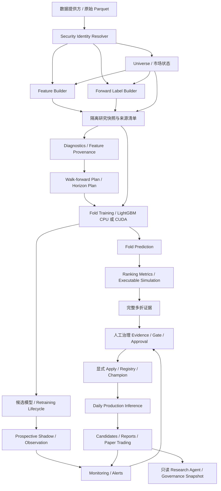

# H5 运行后架构审查与开发计划

日期：2026-09-20  
审查代码基线：`8a3f6e4f92a953d223231872c5e9f8e6ae642a61`  
仓库：`xiaoleshike/ashare-lgbm-quant`  
文档性质：静态代码审查、架构现状与后续建议；不是运行验收证书。

## 1. 范围与证据边界

本次通过 GitHub 读取了多折执行、Ranker 数据加载、特征来源、计算后端 benchmark、标签、回测、基本面与管理员文档等关键路径。不是对每个文件的逐行安全认证，也没有在审查环境运行完整 pytest、真实训练或 CUDA benchmark。

操作员报告 H5 multi-fold 已 COMPLETE、recovery CLEAN。对应本地运行清单、预测、fold 指标和实际 feature-set 文件没有提供给本次审查环境，因此这里不声称重新验证其哈希、数值或实际影响幅度。不把本地研究指标、证券明细、个人身份或机器路径复制进此公开文档。

技术完整性、研究有效性、可执行性和部署资格是四个不同判定。文件哈希链通过，只能证明所保存的文件互相一致，不能排除“用错误股票池产生了一整套相互一致的文件”。

## 2. 综合结论

GPU fold 接口确有缺口，但不是当前最重要的问题。应先修复 evaluation 股票池受未来标签可用性影响、coverage 恒为 1，以及多折执行身份缺少后端/成本契约这三项，再扩展既有 benchmark 的 fold 输入。

保留旧 H5 artifact，用新的 evidence contract 产生派生/替代研究结果。不要原地改写历史。现有训练好的 fold 模型未必需要全部重训，但能否复用必须验证训练与特征选择来源；不能仅因为 model.txt 存在就认定可复用。

GPU 是加速路径，不是 CPU 研究的资格条件。修正口径后可以继续 H10 CPU；不需要等待 GPU，也不需要等四个 horizon 或新模型全部完成，才验收已经确定的一条生产候选链路。

## 3. 当前软件架构

系统适合继续采用单机、Python 模块化、文件优先的架构，不建议改为微服务。



图中是模块关系，不表示这些步骤在一个命令中自动全部执行。尤其 Promotion 不由指标或 Agent 自动触发。现有 qualification-only 隔离与人工授权保持不变。[S8]

| 层 | 当前主要模块 | 权威数据或产物 | 重要边界 |
|---|---|---|---|
| 原始数据与身份 | `data/`、`data/security_identity.py` | Provider 原始数据、版本化 alias 表 | raw 保留来源代码；标准化发生在消费边界 |
| Universe 与特征 | `universe/`、`features/` | 每日 universe、特征及 manifests | 信号日可观测信息；证券身份一致 |
| 标签 | `labels/` | 按 horizon 的 forward labels | 仅训练、成熟收益评价使用；不能控制信号池 |
| 研究计划 | `models/feature_provenance.py`、`walk_forward.py`、`horizon_experiments.py` | 有序 feature set、fold 与 horizon 清单 | 数据治理与时间隔离都要成立 |
| 多折执行 | `models/walk_forward_evaluation.py`、`ranker_data.py` | fold 模型、预测、指标、root manifest | 当前 evaluation 股票池存在 R1 缺口 |
| 计算后端 | `models/compute/` | backend provenance、benchmark | CPU 默认；CUDA 显式；不得静默混用 |
| 执行测量 | `backtest/`、`paper_trading/` | 模拟成交、权益、账本 | 统计代理与真实策略执行契约必须分清 |
| 生产闭环 | `orchestration/`、`models/inference.py`、`strategy/`、`research/` | 生产摘要、预测、候选、日报 | 日常推理不要求 GPU；软阶段隔离 |
| 监控与治理 | `monitoring/`、`governance/`、`models/promotion/` | observation、alerts、审批及 Registry 历史 | 不自动晋升；证据范围和来源精确绑定 |
| 重训与资格验证 | `retraining/` | request、readiness、execution、qualification | 权限/预算/锁；qualification 不等于 Alpha 或部署通过 |

### 目标中的核心解耦

```text
训练阶段：train/validation features + 已成熟标签 -> 模型

评分阶段：signal-date universe + features -> 完整冻结预测
                         （禁止 evaluation labels 参与）

事后统计：冻结预测 LEFT JOIN 已成熟标签 -> IC/NDCG/标签覆盖率

执行阶段：完整冻结预测 -> 原始 Top-N 意图 -> 下一时点行情/约束 -> fills/NAV
```

ModelAdapter 将来只封装 fit/predict/save/load 与模型身份。不要让不同模型各自决定股票池、费用、统计方法或 OOS 边界。

## 4. 代码审查发现

### R1 — P1 / 确认：evaluation 股票池受未来标签可用性影响

`RankerFoldExecutor.execute()` 用 `RankerDataLoader.load()` 构造 evaluation；该 loader INNER JOIN `labels_forward`，过滤 `is_label_available` 和非有限未来收益，再对结果预测并传给 executable simulation。[S1][S2]

这不是说 evaluation target 被直接用于 `fit()`。问题发生在选股集合：未来不可买入、不可按标签定义退出或未来价格缺失的股票，可以在信号形成前被排除。[S4]

修复：评分与标签分离，冻结完整信号日预测；指标再关联成熟标签；执行层处理真实拒单和延迟。改变未来标签不得改变 score、预测键、Top-N 意图。

对旧 H5 的解释：排名指标是过滤后样本上的描述；execution 结论需重评估。不能据此断言 Alpha 消失，也不能量化偏差方向或大小。

### R2 — P1 / 确认：coverage 恒为 1

`_ranking_metrics()` 当前计算 `len(dataset.frame) / max(1, len(dataset.frame))`。非空数据恒为 1，不能反映真实评分/标签覆盖率。[S1]

修复：分别记录 expected universe、features present、scored、mature labels、available labels；逐日输出 prediction coverage 与 label coverage，零分母为 null/status。

### R3 — P1 / 确认：多折运行身份没有包含关键执行契约

`_experiment_identity()` 包含计划、特征、研究策略、语义参数和 processed source identity，但没有训练后端、LightGBM 版本、费用策略和评估执行契约。`training_compute` 只写入 fold manifest，不能阻止同一 run ID 下 CPU/CUDA 误复用或部分运行续跑混用。[S1]

修复：区分 modeling identity 与 execution identity，后者绑定 backend/version/build、evaluation contract、accounting/cost policy。相关策略变更生成新 artifact，不伪装成相同运行。

### R4 — P1 / 条件性风险：可追溯的 feature set 不等于每个 fold 都是特征选择 OOS

`validate_governed_feature_set()` 检验 hash 和推荐特征列表；多折调用方没有将特征选择信息截止时间逐 fold 对照 evaluation_start。[S1][S3]

若统一特征集合用到了某早期 fold 之后的收益，该 fold 不能称为完整 OOS。当前本地 feature provenance 未提供，所以不能断言本次哪些 fold 受影响。

修复：输出 parameter-fit OOS 与 feature-selection OOS 两个标记，检验实际信息成熟时间；不合格的早期回放保留为 retrospective replay，不能悄悄并入严格 OOS 汇总。不要按收益决定是否排除 fold。

### R5 — P1/P2 / 确认：benchmark 输入契约与来源校验需补齐

`TrainingBackendBenchmarkService._source()` 只支持两个模型目录，要求旧式 feature_list 和扁平训练日期，不能消费当前 fold manifest 的结构。[S5]

同时，benchmark 的 source identity 主要来自旧模型清单，而实际数据从当前 configured processed root 读取；`compare()` 的相等性字段没有强制同 LightGBM 版本；`_validate_manifest()` 只校验声明的 hash 项，没有要求完整 mandatory file set。[S5]

修复：增加显式 fold source adapter，复用完整 root-to-leaf validator，绑定实际 train/validation 数据与分组。版本/构建、数据、语义参数一致后比较。拒绝空 hash 清单和路径越界。

### R6 — 研究解释边界：fold 均值不是连续组合业绩

每个 fold 独立调用 `simulate_portfolio()`，该函数从 initial_cash 开始；aggregate 汇总 fold 指标分布。[S1][S6]

因此正收益 fold 比例不是逐笔胜率，fold CAGR/Sharpe 的均值不是一个真实持续账户的 CAGR/Sharpe。Horizon 越长，执行尾部跨月和窗口重叠越需要明确处理。

下一步保存逐日 IC 与执行明细，提供按交易日去重的统计；如需连续 NAV，使用明确的自融资持仓延续策略单独回放，不能直接拼乘独立 fold 收益。置信区间需处理时间相关性，不能把所有股票行或重叠 fold 当独立样本。

### R7 — 执行策略待冻结，而非立即换算法

当前 simulator 以剩余 cash 在可执行股票间分配，并允许 `gross_notional / open` 的小数股。[S6] 这可能是一个明确定义的 cash-funded cohort 研究策略，不自动等价于“错误”；但它不是每日目标权重再平衡，也未必与 Paper Trading 完全一致。

先写清现有策略，再以独立 execution_policy_id 比较 periodic、staggered、target-rebalance。不要把新仓位策略混进 CPU/CUDA benchmark。真执行验收前还应审查整手/零股、费用、企业行动、复权与账户会计。

`load_execution_prices()` 在涨跌停价缺失时仍允许买卖；应区分真实无涨跌幅限制与应有数据缺失。`load_calendar()` 在 end_date 非交易日时先截断未来日期，可能失去退出 buffer；这是其他调用入口的边界问题，不是本次以实际预测日期为终点的 H5 运行失败证据。[S7]

### R8 — 基本面选中时才成为当前硬门槛

财务表当前按 availability_date 做 ASOF，晚公布的旧报告修订可能替代更新报告期，delta 也依公告顺序计算。[S9] 是否影响当前模型取决于实际 feature set，不能从配置 include_fundamentals=true 直接断定入模。

未来启用相关因子前补 report-period/revision、单季/TTM、YoY/QoQ 的经济语义；不强制与当前无关的基本面改造阻塞所有工作。

## 5. 开发顺序与退出条件

| 工作包 | 优先级 | 本次范围 | 退出条件 |
|---|---|---|---|
| A：H5 证据口径修复 | 最高 | R1/R2/R3，R4 分类与校验 | 标签扰动不改预测/信号；coverage 正确；不同执行契约不误复用 |
| B：Fold Backend Adapter | 可并行编码，实际采用前依赖 A | 既有 benchmark 增加 fold 输入及来源/版本检查 | 同 fold 同数据 CPU/CUDA 对比；无 CUDA 明确等待，不阻塞 CPU |
| C：H5 修正重评估 | A 后 | 先小范围真实验证，再按新契约完成必要重评估 | 数据、覆盖率、口径均可解释；历史文件不改写 |
| D：H10 对照与时间统计 | C 后 | 相同特征/选择政策、同预测股票池契约的 CPU 或合格 CUDA 实验 | 描述性与严格 OOS 分开；含成本、Top-N、稳定性 |
| E：执行语义与 Paper 对齐 | 真实执行验收前 | 策略定义、整手、费用、企业行动、连续 NAV、拒单 | 同输入同契约的 backtest/paper 会计回归一致 |
| F：小规模模型挑战 | C 的可信基线后可并行 | 先 LightGBM 回归目标对照，再 XGBoost Ranker；CatBoost 后续 | 未触碰 lockbox，预算固定，同折公平，增益与稳定性均检查 |
| G：真实 Operational Qualification | 已选执行/数据契约可信后 | 验证一条确定的模型与后端路径 | QUALIFIED/recovery CLEAN/不变式通过；不要求其他模型全部完成 |
| H：Prospective 候选与专属 Paper | G 后，沿既有人工治理 | 日常 Shadow/Observation、专属候选账户与证据 | 不借用 Champion 账户；不自动晋升 |

H20/H60 可以保留为后续对照，不要求一次性全部跑满。共享 evaluation 日期不必强制共享同长度训练 gap；未来可以对比 horizon-specific gap，但本次不更改既有 purge/embargo。

不再增加“新模型必须先全部完成，才能验收现有系统”的依赖。Qualification 证明系统执行路径，不能证明策略有 Alpha；模型改进与平台验收可以分别推进。

## 6. 提高推荐质量的实验路线

推荐先回答“哪里丢失 Alpha”，而不是先增加模型数量：

1. 分解完整 universe -> 有效特征 -> 模型排名 -> 策略过滤 -> 可交易订单 -> 成交 -> 净收益。
2. 按 Top10/20/50 比较缺失标签、换手、行业/规模暴露和执行成本；Rank IC 只作为一个维度。
3. 冻结特征、fold、执行策略与有限实验预算，比较 LambdaRank 和 LightGBM 连续收益回归目标。
4. 引入 XGBoost Ranker 作为第一种外部模型族。官方接口支持 `rank:ndcg` 与按 query 排序的 qid；在本项目中 query 应是 trade_date，不能随机打乱时间做普通 CV。[S10]
5. 如有增量信号再引入 CatBoostRanker；CPU/GPU、loss、量化边界须显式冻结，不能依赖不同后端的不同默认值。[S11]
6. 只有逐日截面排名与 Top-N 持仓显示差异且有净收益互补，才试固定等权 percentile ensemble；禁止混合 raw scores 或按已观察 holdout 挑权重。

暂缓深度时序网络、Kelly、复杂市场状态切换、分钟级预测、AutoML 大搜索。分钟行情优先规划为后续执行验证的数据来源，而不是打断本次修复。

旧工程容差（例如非常高的 CPU/CUDA 预测相关阈值）不是自然定律。先记录 CPU 重复运行波动、逐日相关与 Top-N overlap，按事先冻结的工程标准判定；不能为了让 CUDA 通过事后放宽政策。LightGBM 官方也区分 CPU deterministic 设置与不同版本/编译/后端的数值行为。[S12]

## 7. 性能优化

先记录每个 fold 的 source validation、load、dtype/group 构建、fit、predict、accounting、publish 时间。不要只看 fit 的 GPU speedup。

优先考虑 train/validation 列裁剪、有限且可验证的分区缓存、避免 repeated DataFrame copies、单卡串行 benchmark、控制 CPU threads。回测每日 turnover 应累计当日成交额，避免反复扫描所有历史 trades。不要使用缓存跳过不可变来源校验，也不要用 mtime/文件名替代内容身份。

环境采用受控锁定依赖或构建清单；CUDA-enabled LightGBM 构建须另外记录，不在审查期间自动安装或升级。

## 8. 运维与文档提交边界

本提交仅新增设计文档，不更改源码、配置、模型、数据、审批或运行状态。GitHub Actions 的既有问题继续延期，不更改 workflow。

源代码文本扫描不覆盖 Git commit author/committer 元数据，因此不能据此保证仓库完全没有个人身份信息。运行 CSV 与历史提交的清理属于独立隐私任务，不能在本次文档提交中自动重写 Git 历史。

## 9. 代码与官方参考

以下代码链接固定到审查 commit；所有“修复/目标”描述是本次建议，不表示已经实现。

- [S1 Walk-forward executor、coverage、identity 与聚合](https://github.com/xiaoleshike/ashare-lgbm-quant/blob/8a3f6e4f92a953d223231872c5e9f8e6ae642a61/src/ashare_quant/models/walk_forward_evaluation.py)
- [S2 RankerDataLoader](https://github.com/xiaoleshike/ashare-lgbm-quant/blob/8a3f6e4f92a953d223231872c5e9f8e6ae642a61/src/ashare_quant/models/ranker_data.py)
- [S3 Feature provenance](https://github.com/xiaoleshike/ashare-lgbm-quant/blob/8a3f6e4f92a953d223231872c5e9f8e6ae642a61/src/ashare_quant/models/feature_provenance.py)
- [S4 Label builder](https://github.com/xiaoleshike/ashare-lgbm-quant/blob/8a3f6e4f92a953d223231872c5e9f8e6ae642a61/src/ashare_quant/labels/builder.py)
- [S5 CPU/CUDA benchmark](https://github.com/xiaoleshike/ashare-lgbm-quant/blob/8a3f6e4f92a953d223231872c5e9f8e6ae642a61/src/ashare_quant/models/compute/benchmark.py)
- [S6 Portfolio simulator](https://github.com/xiaoleshike/ashare-lgbm-quant/blob/8a3f6e4f92a953d223231872c5e9f8e6ae642a61/src/ashare_quant/backtest/engine.py)
- [S7 Execution data/calendar](https://github.com/xiaoleshike/ashare-lgbm-quant/blob/8a3f6e4f92a953d223231872c5e9f8e6ae642a61/src/ashare_quant/backtest/data.py)
- [S8 管理员文档](https://github.com/xiaoleshike/ashare-lgbm-quant/blob/8a3f6e4f92a953d223231872c5e9f8e6ae642a61/docs/system_administrator_guide.md)
- [S9 Fundamental PIT implementation](https://github.com/xiaoleshike/ashare-lgbm-quant/blob/8a3f6e4f92a953d223231872c5e9f8e6ae642a61/src/ashare_quant/features/fundamentals.py)
- [S10 XGBoost learning-to-rank 官方文档](https://xgboost.readthedocs.io/en/stable/tutorials/learning_to_rank.html)
- [S11 CatBoost CPU/GPU 差异官方文档](https://catboost.ai/docs/en/concepts/faq)
- [S12 LightGBM 参数官方文档](https://lightgbm.readthedocs.io/en/v4.3.0/Parameters.html)
